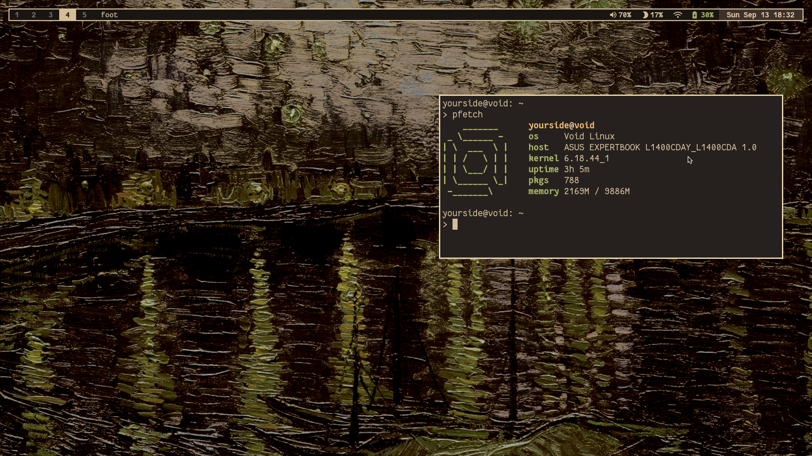

# My Dotfiles

A modular dotfiles deployment configuration managed via GNU Stow.



## Dependencies

Base requirements:

- `git` – clone this repository
- `make` – run the deployment targets
- `stow` (GNU Stow) – deploy packages as symlinks

Each package maps to an application or toolset you must have installed for its
config to be useful:

| Package | Software |
| :--- | :--- |
| `alacritty` | `alacritty` terminal |
| `bin` | Custom scripts under `~/.local/bin`: `fuzzel`, `cliphist`, `wl-clipboard` (`wl-copy`/`wl-paste`), `brightnessctl`, `wireplumber` (`wpctl`), `grim`, ImageMagick (`magick`), `slurp`, `jq`, `mpv`, `gammastep`, `libnotify` (`notify-send`), `playerctl`, `systemd`, `sudo` |
| `fonts` | Fantasque Sans Mono Nerd Font, stow'd to `~/.local/share/fonts` (XDG dir, auto-scanned by fontconfig) |
| `foot` | `foot` terminal + `footclient` |
| `fuzzel` | `fuzzel` launcher |
| `kew` | `kew` terminal music player |
| `kitty` | `kitty` terminal |
| `mako` | `mako` notification daemon (used by the `osd` script) |
| `music` | `mpd`, `rmpc` UI, PulseAudio/PipeWire output |
| `neovim` | `neovim` (LazyVim) – lazy-loader bootstraps `git`; `ripgrep`/`fd` recommended |
| `niri` | `niri` compositor, `waybar`, `wbg`, `foot`, `fuzzel`, `swaylock`, `mako`, `cliphist`, `wl-clipboard`, `oniri`, `playerctl`, `brightnessctl`, `wl-mirror`, `jq`, `systemd` |
| `shell` | `zsh`, `bash`, `fzf`, `zsh-autosuggestions`, `zsh-syntax-highlighting` (vendored: `fzf-tab`, `zsh-vi-mode`) |
| `swaylock` | `swaylock` screen locker |
| `waybar` | `waybar` status bar (clock, calendar, battery, network, backlight, tray, idle-inhibitor modules) |
| `yazi` | `yazi` file manager, `allmytoes` previewer (also shipped in `bin`), ImageMagick (`magick`) for svg/heic/jxl previews |
| `zed` | `zed` editor |

## Quick Start Deployment Tutorial

Follow these four steps to deploy your dotfiles onto a new machine cleanly.

### Step 1: Clone the Repository
Clone your dotfiles directly into your preferred configuration path:
```bash
git clone https://github.com/akunnyaanam/dotfiles ~/.config/dotfiles
cd ~/.config/dotfiles
```

### Step 2: Set Up Your Profile
Run the `make profile` command to set up your profile:
```bash
make profile
```
This scans the root directory and generates a `stowprofile` file listing every
package directory (excluding `.git`).

### Step 3: Customize Packages (Optional)
Edit the `stowprofile` file to customize which packages are deployed.
Packages are read at runtime from this file; blank lines and lines starting
with `#` are ignored.

```bash
nvim stowprofile
```
Example:
```
shell
zed  # <-- Commented out; will not be deployed
```

> If no `stowprofile` exists, all top-level directories (except `.git`) are
> treated as active packages.

### Step 4: Deploy
```bash
make check  # Dry run, checking what stow doin
make link   # Deploy files to your home directory
```

`stow` targets `$HOME` using the defaults in `.stowrc` (which also ignore
`.git`, `.stowrc`, `Makefile`, `stowprofile`, `README.md`, etc.).

## Command Reference

| Command | Action |
| :--- | :--- |
| `make` / `make helper` | Print the command manual and current active profile |
| `make profile` | Scan root directory and generate/reset local `stowprofile` |
| `make link` | Deploy active profile configurations as symlinks to `~` (no folding) |
| `make unlink` | Purge deployed symlinks cleanly from `~` |
| `make relink` | Refresh deployment state (`unlink` followed immediately by `link`) |
| `make clean` | Destructively delete physical home files or dead links blocking Stow |
| `make check` | Execute non-destructive dry run with high verbosity to preview changes |
